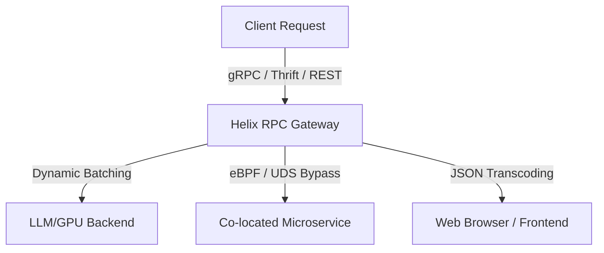

# Introducing Helix RPC: Next-Generation AI Gateway and Microservice Framework

**Date**: July 4, 2026  
**Author**: The Helix RPC Team  

As microservice architectures evolve and artificial intelligence workloads become a critical component of modern software stacks, software engineers face a growing dilemma. Standard remote procedure call (RPC) frameworks, designed over a decade ago, are failing to keep up with the demands of highly concurrent, latency-sensitive, and multi-lingual service topologies.

Today, we are thrilled to introduce **Helix RPC**: a unified, high-performance RPC gateway and service framework built from the ground up for maximum throughput, state-of-the-art resilience, and developer velocity.

---

## Why Helix RPC?

In today's cloud-native systems, we are often forced to choose between the developer friendliness of **REST/JSON**, the strict type guarantees and broad adoption of **gRPC/Protobuf**, and the high-efficiency compact representation of **Apache Thrift**. 

Compounding this protocol fragmentation is the rise of **Large Language Models (LLMs)**. AI serving demands unique runtime primitives—such as dynamic request batching, exponential backoff with request hedging, token-based rate limiting, and real-time Server-Sent Events (SSE)—which traditional RPC frameworks do not support natively.

Helix RPC bridges this gap by unifying these protocols under a single compiler schema and equipping the runtimes with production-grade traffic controls.

---

## Key Features That Make Helix Superior

### 1. Zero-Config Multi-Protocol Transcoding
Helix allows you to define your service contracts once using Protobuf IDL. The compiler then generates dual-protocol stubs allowing a server to accept **gRPC (HTTP/2)**, **Thrift (Framed Compact/Binary)**, and **REST (HTTP/1.1 JSON)** concurrently on the exact same port. You no longer need to deploy heavy proxy sidecars (like Envoy) just to convert JSON requests into high-speed internal RPC frames.

### 2. Native AI/LLM serving primitives
Helix runtimes in Go, Rust, Python, and Node.js have built-in support for:
- **Dynamic Request Batching**: Merges concurrent individual requests into a single batched array before passing them to GPU-bound model inference, increasing hardware utilization by up to 4x.
- **SSE Streaming**: Seamlessly streams response chunks back to clients for real-time generative AI interfaces.
- **Token Bucket Rate Limiting**: Built-in, high-efficiency rate limiters that throttle requests per second at the application layer.

### 3. State-of-the-Art Resiliency
Traditional client libraries rely on external service meshes to handle network faults. Helix bakes resilience directly into the client connection pool:
- **P99 Hedging**: Automatically sends a duplicate request to a backup instance if the primary request exceeds a predefined response threshold, cutting tail latency in half.
- **Circuit Breakers**: Protects downstream services by immediately failing fast when error rates spike.
- **Exponential Backoff**: Built-in retry policies that prevent thundering herd problems on system recovery.

---

## The Road Ahead

Helix RPC is open-source and ready for production workloads. We have designed our runtimes to be extremely lightweight, making them an excellent choice for Kubernetes deployments, serverless functions, and resource-constrained environments.

- **Check out our documentation**: Learn how to write your first schema and get started.
- **Read our next post**: Learn about the [novel zero-allocation binary optimizations](deep-dive-advanced-optimizations.md) that power our compiler and runtimes.
- **Join the community**: We welcome contributions, feature requests, and feedback on our GitHub repository.
