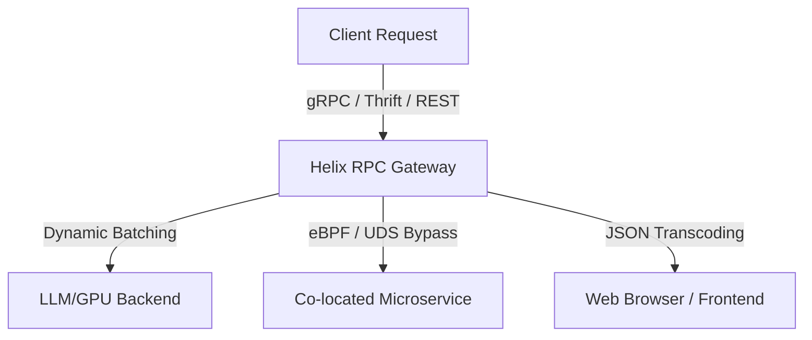

# Introducing Helix RPC: Next-Generation AI Gateway and Microservice Framework

**Date**: July 4, 2026  
**Author**: The Helix RPC Team  

As microservice architectures evolve and artificial intelligence workloads become a critical component of modern software stacks, software engineers face a growing dilemma. Standard remote procedure call (RPC) frameworks, designed over a decade ago, are failing to keep up with the demands of highly concurrent, latency-sensitive, and multi-lingual service topologies.

Today, we are thrilled to introduce **Helix RPC**: a unified, high-performance RPC gateway and service framework built from the ground up for maximum throughput, state-of-the-art resilience, and developer velocity.

---

## The Modern Microservices Dilemma: Protocol Fragmentation

In today's cloud-native systems, engineering teams are often forced to make compromises when selecting a communication protocol:

1. **REST/JSON (HTTP/1.1 or HTTP/2)**: Extremely developer-friendly, human-readable, and supported by every client library. However, it lacks strict typing, suffers from high parsing overhead, and wastes bandwidth due to verbose text formatting.
2. **gRPC over HTTP/2 (Protobuf)**: Offers strict schema contracts, small binary payload sizes, and streaming support. Unfortunately, it is notoriously hard to consume directly from web browsers without translation proxies (like Envoy or `grpc-gateway`), and HTTP/2 stream multiplexing can run into head-of-line blocking under heavy packet loss.
3. **Apache Thrift**: Highly performant and popular in large-scale mono-repo organizations (like Meta or Uber), but features a highly fragmented runtime ecosystem and lacks native JSON transcoding.

### Enter Helix RPC

Helix RPC bridges this gap by unifying these protocols under a single compiler schema and equipping the runtimes with production-grade traffic controls.



---

## Architectural Deep Dive: What Makes Helix Superior

Helix RPC is not just another wrapping library; it is a unified compilation target and transport layer designed for high-performance distributed systems.

### 1. Zero-Config Multi-Protocol Transcoding
Helix allows you to define your service contracts once using Protobuf IDL. The compiler then generates dual-protocol stubs allowing a server to accept **gRPC (HTTP/2)**, **Thrift (Framed Compact/Binary)**, and **REST (HTTP/1.1 JSON)** concurrently on the exact same port. You no longer need to deploy heavy proxy sidecars (like Envoy) just to convert JSON requests into high-speed internal RPC frames.

For example, a single server instance can process these incoming requests transparently:

- A binary gRPC payload from a Go microservice
- A binary Thrift Compact payload from a legacy Java client
- A JSON POST request from a web frontend browser

### 2. Native AI/LLM serving primitives
Traditional RPC frameworks were designed around low-latency CRUD database operations. They are fundamentally unsuited for AI serving workloads where model inference is extremely slow and requires high GPU utilization.

Helix runtimes in Go, Rust, Python, and Node.js have built-in support for:

- **Dynamic Request Batching**: Merges concurrent individual requests into a single batched array before passing them to GPU-bound model inference, increasing hardware utilization by up to 4x.
- **SSE Streaming**: Seamlessly streams response chunks back to clients for real-time generative AI interfaces.
- **Token Bucket Rate Limiting**: Built-in, high-efficiency rate limiters that throttle requests per second at the application layer.

### 3. Client-Side Resiliency Engine
Traditional client libraries rely on external service meshes to handle network faults. Helix bakes resilience directly into the client connection pool:

- **P99 Hedging**: Automatically sends a duplicate request to a backup instance if the primary request exceeds a predefined response threshold, cutting tail latency in half.
- **Circuit Breakers**: Protects downstream services by immediately failing fast when error rates spike.
- **Exponential Backoff**: Built-in retry policies that prevent thundering herd problems on system recovery.

---

## Getting Started: A Quick Example

Define your service contract in a standard Protobuf IDL file:

```protobuf
syntax = "proto3";
package helix_example;

message UserProfileRequest {
    int64 user_id = 1;
}

message UserProfile {
    int64 user_id = 1;
    string username = 2;
    string email = 3;
}

service UserProfileService {
    rpc GetUserProfile(UserProfileRequest) returns (UserProfile);
}
```

Compile it using the Helix compiler (`helix-gen`):

```bash
helix-gen generate -idl schema.proto -lang rust -out src/generated.rs
helix-gen generate -idl schema.proto -lang go -out pkg/generated.go
```

The compiler generates all serializing logic, type stubs, client pools, and server handlers. Implementing your backend service is as simple as filling in the trait method in Rust or struct methods in Go.

---

## Conclusion

Helix RPC is open-source and ready for production workloads. We have designed our runtimes to be extremely lightweight, making them an excellent choice for Kubernetes deployments, serverless functions, and resource-constrained environments.

- **Check out our documentation**: Learn how to write your first schema and get started.
- **Read our next post**: Learn about the [novel zero-allocation binary optimizations](deep-dive-advanced-optimizations.md) that power our compiler and runtimes.
- **Join the community**: We welcome contributions, feature requests, and feedback on our GitHub repository.
