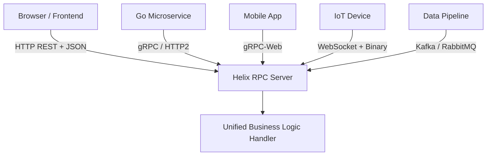
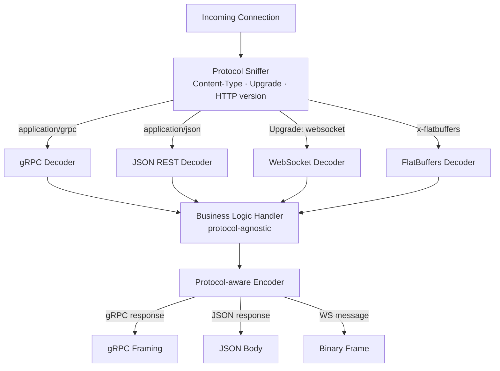

# Multi-Protocol Architecture: The Case for Speaking Every Language at Once

**Date**: July 12, 2026  
**Author**: The Helix RPC Team  

For most of the last decade, engineering teams building microservices faced the same uncomfortable question at the outset of every new project: **which protocol do we standardize on?**

The debate was rarely clean. REST over HTTP/1.1 won hearts for its familiarity and browser compatibility. gRPC earned respect for performance and strong typing. WebSockets unlocked real-time bidirectional communication. GraphQL became the darling of API gateway teams. Message brokers like Kafka and RabbitMQ solved async workloads that none of the above could elegantly handle.

Inevitably, organizations made a choice — often dictated by the team's background or the loudest architect in the room — and committed to it. And for years, that worked. Until the system grew.

The uncomfortable truth is: **no single protocol is optimal for every communication pattern inside a complex distributed system.** Once you accept that, multi-protocol architecture stops being an exotic concept and starts looking like basic engineering hygiene.

---

## What Is Multi-Protocol Architecture?

A multi-protocol architecture is one where a single service (or framework) can simultaneously speak multiple transport languages — serving gRPC, HTTP/REST, WebSocket, and message-queue protocols through a unified business logic layer, without requiring the developer to rewrite or duplicate their service implementation for each transport.

Think of it like a skilled interpreter who can hold a fluent conversation in English, Mandarin, and Spanish — all translating the same underlying idea without distortion.

In practice, this means:
- The **same handler** responds to a gRPC unary request from an internal Go microservice AND a REST/JSON request from a browser frontend.
- The **same payload schema** (defined in Protobuf or FlatBuffers) is reused across all transports.
- The **same middleware stack** (auth, rate limiting, tracing) applies uniformly regardless of how the client connected.



---

## The Five Concrete Benefits

### 1. Universal Client Compatibility

Different clients have different requirements, and you cannot always control what protocol they use. A backend that only speaks gRPC forces every browser client through an Envoy or grpc-gateway translation proxy, adding latency and operational overhead. A multi-protocol server eliminates the proxy entirely.

| Client Type | Natural Protocol |
|---|---|
| Browser / Frontend JS | WebSocket or HTTP/REST |
| Mobile App (iOS/Android) | HTTP/2 or gRPC-Web |
| Internal Go microservice | gRPC (HTTP/2) |
| Legacy enterprise system | REST/JSON |
| IoT device | WebSocket + binary frames |
| Data pipeline | Kafka / RabbitMQ |

A multi-protocol service meets all of these clients where they are — a single deploy serves them all, with zero translation gateways in the hot path.

### 2. Protocol-Optimal Performance Per Workload

Different communication patterns perform best on different transports. Locking your entire system to a single protocol forces a performance compromise on every workload that doesn't fit that shape.

| Workload | Optimal Protocol | Why |
|---|---|---|
| High-frequency request/response | gRPC (HTTP/2) | Binary framing, header compression, stream multiplexing |
| Real-time push / streaming | WebSocket | Persistent connection, zero HTTP overhead per message |
| High-volume async event ingestion | Kafka | Durable log, consumer group fan-out, replay on failure |
| Public APIs and browser clients | REST/JSON | Universally supported, proxy-friendly, debuggable |
| Large payload delivery | gRPC streaming | Backpressure-controlled chunked transfer |

With multi-protocol, the framework routes each request through the optimal decoder for that transport — squeezing maximum throughput out of the infrastructure you already have, without you having to configure anything differently per endpoint.

### 3. Zero-Disruption Incremental Migration

Legacy migrations are among the most expensive and risky activities in software engineering. Attempting a wholesale "rip-and-replace" of a REST API with gRPC across dozens of teams simultaneously is a recipe for months of broken integrations and painful rollbacks.

Multi-protocol architecture enables **incremental, side-by-side migration**:

```
Phase 1: REST only               Phase 2: REST + gRPC              Phase 3: gRPC primary
┌──────────────────┐             ┌──────────────────┐              ┌──────────────────┐
│  All → REST      │  ──────►   │  Browser → REST  │   ──────►   │  Services → gRPC │
└──────────────────┘             │  Services → gRPC │              │  Browser → REST  │
                                 └──────────────────┘              │  (backward compat│
                                                                   │  maintained)     │
                                                                   └──────────────────┘
```

New services adopt gRPC immediately for inter-service calls. Old clients keep talking REST. No one needs to coordinate a big-bang cutover. Teams migrate at their own pace — and the protocol boundary disappears from the problem space entirely.

### 4. Unified Security Middleware

In a heterogeneous microservices environment with separate REST gateways, gRPC interceptors, and WebSocket handlers, security controls are notoriously inconsistent. JWT validation lives in one place, API key checks in another, rate limiting in a third. The attack surface grows with every new entry point added.

Multi-protocol architecture collapses this complexity by enforcing security uniformly at the framework level:

```
┌─────────────────────────────────────────────────────────┐
│                  Unified Auth Middleware                 │
│     JWT validation · Rate limiting · mTLS · RBAC        │
└──────────────────────────┬──────────────────────────────┘
                           │
           ┌───────────────┼──────────────┐
           ▼               ▼              ▼
      gRPC Handler    REST Handler    WS Handler
      (same logic)    (same logic)   (same logic)
```

Security rules written once apply everywhere. Adding a new protocol transport does not create a new security gap — it inherits the same hardened middleware automatically.

### 5. Unified Observability

Distributed tracing across protocol boundaries has historically been a pain point. When a request enters as gRPC, gets routed through Kafka, and exits as a webhook POST, reconstructing the full trace requires stitching together disjoint telemetry systems.

Multi-protocol frameworks propagate **W3C TraceContext headers and OpenTelemetry spans** across all transports natively, producing a single end-to-end trace regardless of how many protocol hops a request makes:

```
[Browser REST] → [gRPC handler] → [Kafka sink] → [async consumer] → [REST webhook]
   Span A            Span B           Span C           Span D            Span E
└──────────────────── Single distributed trace (one dashboard, no gaps) ───────────┘
```

---

## How Helix RPC Implements Multi-Protocol Natively

Helix RPC was designed from first principles around this philosophy. Every runtime (Go, Rust, Node.js, Python, Java, C++) exposes your business logic through a **multiplexed server** that auto-detects the incoming protocol from the request framing and dispatches accordingly — no configuration required.

```go
// One server. One handler. Every protocol, automatically.
s := runtime.NewServer(runtime.Config{
    Port:    8080,
    Handler: myBusinessLogic,
})

// Automatically handles inbound:
// - gRPC        (Content-Type: application/grpc)
// - FlatBuffers (Content-Type: application/x-flatbuffers)
// - JSON REST   (Content-Type: application/json)
// - WebSocket   (Upgrade: websocket header)
s.ListenAndServe()
```

The detection logic inspects the `Content-Type`, `Upgrade`, and HTTP version headers of each incoming connection, dispatching to the appropriate decoder — and feeding the same deserialized struct into business logic regardless of which path it arrived through.



On the egress side, Helix serializes the response back in the format the client spoke. A gRPC client receives a gRPC framed response. A REST client receives JSON. A WebSocket client receives a binary message frame. The handler author **never writes a single line of transport-specific code**.

---

## Common Objections (And Why They Don't Hold Up)

### "Multi-protocol adds complexity"

The complexity is always there — it just lives inside your application code instead of the framework. Multi-protocol frameworks **relocate** the complexity to a single, well-tested, hardened layer that every team benefits from, rather than each team reinventing transport handling separately.

### "gRPC is fast enough for everything"

gRPC is excellent for synchronous inter-service RPC. It is poorly suited for browser clients without proxies, for high-volume event streaming at Kafka-scale, or for real-time bidirectional scenarios where WebSocket's persistent connection model is more natural and efficient. Using one tool for every job produces mediocre results everywhere.

### "We'll use an API gateway to translate"

Translation gateways (like Envoy's gRPC-JSON transcoder) solve part of the problem but introduce serialization round-trips, add operational overhead, and do not help with WebSocket or async message-queue patterns. They are a band-aid over a protocol mismatch — not a foundation for a multi-protocol system.

---

## Ecosystem Integration: Richer Than Just Transports

Helix RPC's multi-protocol support extends beyond just request/response transports. The same unified handler can asynchronously publish to message brokers, enabling seamless event-driven patterns alongside synchronous RPC:

```go
// Attach a Kafka sink to any handler — fire-and-forget async events
sink, _ := runtime.NewKafkaAsyncSink("broker:9092")
s.OnRequest(func(ctx context.Context, req *UserRequest) (*UserResponse, error) {
    // Synchronous RPC response to the caller
    resp := processRequest(req)
    
    // Simultaneously sink the event to Kafka for downstream consumers
    sink.PublishAsync("user-events", req.UserID, marshalEvent(req))
    
    return resp, nil
})
```

This pattern is available in all six supported runtimes — Go, Rust, Node.js, Python, Java, and C++ — with native Kafka and RabbitMQ producers for each.

---

## Looking Forward: The Protocol-Agnostic Future

The trajectory of distributed systems architecture clearly points toward **protocol transparency**. Service mesh technologies like Linkerd and Istio have already abstracted away mTLS and load balancing from application developers. Multi-protocol frameworks take this a step further, abstracting away the transport layer itself.

In five years, the question "which protocol should we use for this service?" will be as irrelevant as "which CPU architecture should this code target?" — the framework handles it, and engineers focus entirely on business logic.

The teams and organizations that invest in multi-protocol architecture today are building systems that are:

- **Easier to migrate** — protocol changes don't require rewrites
- **More performant** — each workload uses its optimal transport
- **More secure** — a single hardened auth layer, not a patchwork
- **More observable** — end-to-end traces across every protocol hop
- **More compatible** — every client speaks to the same service

That is not a marginal improvement. It is a fundamental shift in how distributed systems are designed and operated.

---

## Get Started

Helix RPC ships multi-protocol support as a first-class, zero-configuration feature across all six supported runtimes. To explore it yourself:

```bash
git clone https://github.com/helixrpc/helix-rpc
cd helix-rpc/examples/multi-protocol
go run main.go
```

Then send requests in any protocol to `localhost:8080` and watch them all resolve through the same handler.

→ See the [Architecture Overview](../architecture.md)  
→ Read the [Developer Guide](../developer-guide.md)  
→ Explore [Ecosystem Integrations](../integrations.md)
